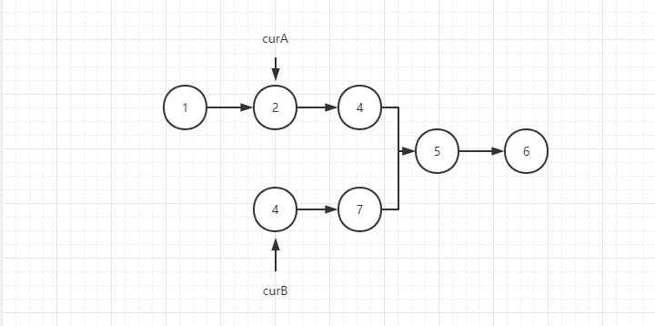
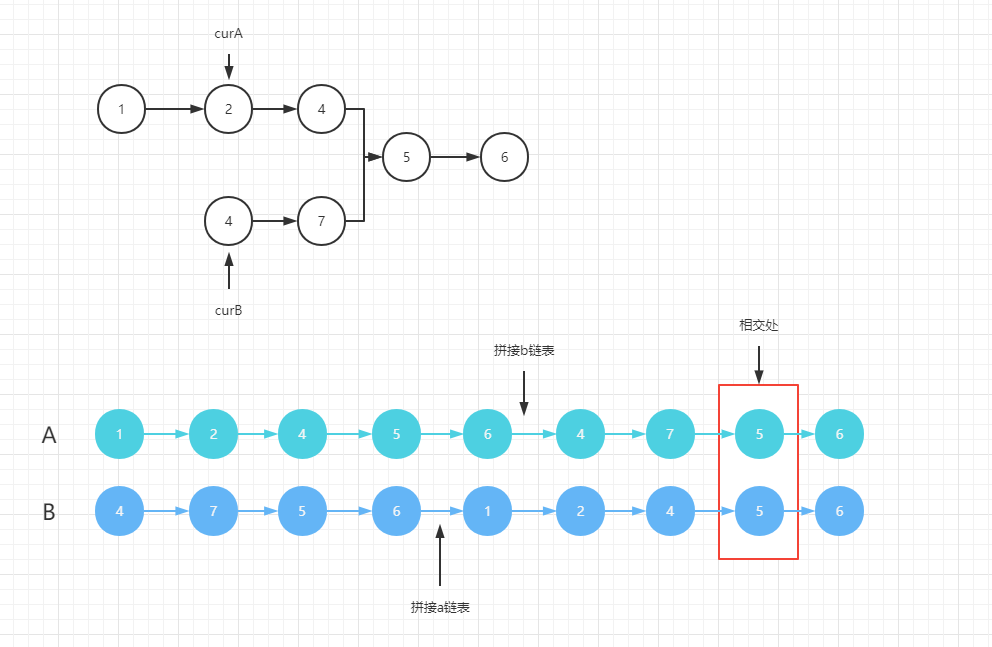

###  相交链表（难度：简单）


给你两个单链表的头节点 headA 和 headB ，请你找出并返回两个单链表相交的起始节点。如果两个链表没有交点，返回 null 。

图示两个链表在节点 c1 开始相交：

题目数据 保证 整个链式结构中不存在环。

注意，函数返回结果后，链表必须 保持其原始结构 。

示例 1：


```
输入：intersectVal = 8, listA = [4,1,8,4,5], listB = [5,0,1,8,4,5], skipA = 2, skipB = 3
输出：Intersected at '8'
解释：相交节点的值为 8 （注意，如果两个链表相交则不能为 0）。
从各自的表头开始算起，链表 A 为 [4,1,8,4,5]，链表 B 为 [5,0,1,8,4,5]。
在 A 中，相交节点前有 2 个节点；在 B 中，相交节点前有 3 个节点。
```
示例 2：

```
输入：intersectVal = 2, listA = [0,9,1,2,4], listB = [3,2,4], skipA = 3, skipB = 1
输出：Intersected at '2'
解释：相交节点的值为 2 （注意，如果两个链表相交则不能为 0）。
从各自的表头开始算起，链表 A 为 [0,9,1,2,4]，链表 B 为 [3,2,4]。
在 A 中，相交节点前有 3 个节点；在 B 中，相交节点前有 1 个节点。
```
示例 3：

```
输入：intersectVal = 0, listA = [2,6,4], listB = [1,5], skipA = 3, skipB = 2
输出：null
解释：从各自的表头开始算起，链表 A 为 [2,6,4]，链表 B 为 [1,5]。
由于这两个链表不相交，所以 intersectVal 必须为 0，而 skipA 和 skipB 可以是任意值。
这两个链表不相交，因此返回 null 。
```

#### 解题思路

相交链表是常见的链表题目之一，这道也拥有多种解题思路，下面介绍一下。

1. 使用额外空间存储节点

利用set或者map等存储结构，先保存另一条链表上的所有节点。

然后遍历另一条链表，判断节点在存储的set或map中是否存在，如果存在，那就是相交的结点。
```JavaScript
var getIntersectionNode = function(headA, headB) {
    let curA = headA,curB = headB;
    let set = new Set()
    while( curA ){
        set.add(curA)
        curA = curA.next;
    }
    while( curB ){
        if( set.has(curB) ) return curB;
        curB = curB.next
    }
    return null
};
```

2. 双指针

第一种解法需要用额外的空间去存储，所以空间复杂度为O(n)，使用双指针可以将空间复杂度降至O(1)。

先定义两个指针，然后让两个指针在不同链表的相同位置上，然后再一起移动，如果两个指针所对应的结点相等，那么这个结点就是相交的结点。



两个链表长度不一，还需要算出长链表指针需要先走几步才能和短链表指针在同一位置。

这个也很简单，两个链表之间的长度差就是长链表指针需要先移动的步数，贴上最终代码：

```JavaScript
var getIntersectionNode = function(headA, headB) {
    let curA = headA,curB = headB;
    let lenA = 0,lenB = 0;
    // 算出A链表长度
    while( curA ){
        lenA++;
        curA = curA.next;
    }
    // 算出B链表长度
    while(curB){
        lenB++;
        curB = curB.next;
    }
  	// 重新赋值指针
    curA = headA
    curB = headB;

    let gap = Math.abs(lenA-lenB);
    // 长链表指针先移动
    if( lenB > lenA ){
        while(gap){
            curB = curB.next;
            gap--
        }
    }

    else{
        while(gap){
            curA = curA.next;
            gap--
        }
    }
    // 一起移动
    while(curA && curB){
        if(curA === curB) return curA
        else{
            curA = curA.next
            curB = curB.next
        }
    }
    return null
};
```

3. 双指针 Ⅱ

这种解法其实是第二种的优化版，因为两个链表存在长度差的问题，所以为了能让两个链表在同一个起点一起移动，就需要让长链表指针先走N步。

而这个过程又比较繁琐，要分别先求出两个链表长度、算出差值、然后再进行移动。

那能不能一开始就消除长度差呢？答案是可以的，我们都知道a+b = b+a，也就是说虽然两个链表长度不同，但是它们的和是固定的，所以让a链表拼接上b链表，让b链表拼接上a链表，不就消除长度差了吗！

两个链表长度差消除了，就可以从头开始一起遍历，最终就能够找到相交的节点。



最后附上代码
```JavaScript
var getIntersectionNode = function(headA, headB) {
    let curA = headA,curB = headB;
    while(curA !== curB ){
        curA = curA ? curA.next : headB
        curB = curB ? curB.next : headA
    }
    return curA
};
```