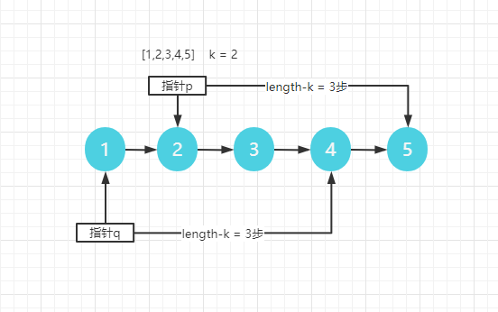

###  链表中倒数第k个节点（难度：简单）

输入一个链表，输出该链表中倒数第k个节点。为了符合大多数人的习惯，本题从1开始计数，即链表的尾节点是倒数第1个节点。

例如，一个链表有 6 个节点，从头节点开始，它们的值依次是 1、2、3、4、5、6。这个链表的倒数第 3 个节点是值为 4 的节点。

 

示例：
```
给定一个链表: 1->2->3->4->5, 和 k = 2.

返回链表 4->5.
```

#### 解题思路
这道的思路和**876.链表的中间结点**的相同，都是找链表中某个节点的题目。

第一种解法还是将链表转化成数组来处理，然后直接返回**length-k**索引的值就好了
```JavaScript
var getKthFromEnd = function(head, k) {
    let res = [],cur = head;

    while(cur){
        res.push(cur)
        cur = cur.next;
    }
    return res[res.length-k]
};
```

不想用数组的话，就使用两次遍历，第一次用来确定链表长度，第二次用来确定位置k。

```JavaScript
var getKthFromEnd = function(head, k) {
    let p = 0,q = 0;
    let cur = head
    while(cur){
        ++p;
        cur = cur.next
    };
    cur = head;
    while(q !== p-k){
        ++q;
        cur = cur.next
    };
    return cur
};
```

第876题因为刚好求得是中间结点的位置，使用快慢指针，只要快指针每一次比慢指针走快一步。那么当快指针走完时，慢指针刚好走了一半。

这道题同样也可以用快慢指针，大概的思路如下：

要找到倒数第k的结点，也就是说，指针需要走**length-k步**，但是链表的length又无法直接确定，那么要怎么让指针走length-k步呢？

如果让一个指针指向链表中第k的位置，那么当它走完之后，不就是走了length-k步了吗？




因此，就可以使用两个指针，一个用来确定需要走多少步，另一个则负责移动，步骤如下：

1. 首先需要定义一个指针p，先走k步。
2. 然后再定一个指针q，指向头结点。
3. 此时两个节点一起移动，当p到终点的时候，q也就到达了倒数第k个位置

